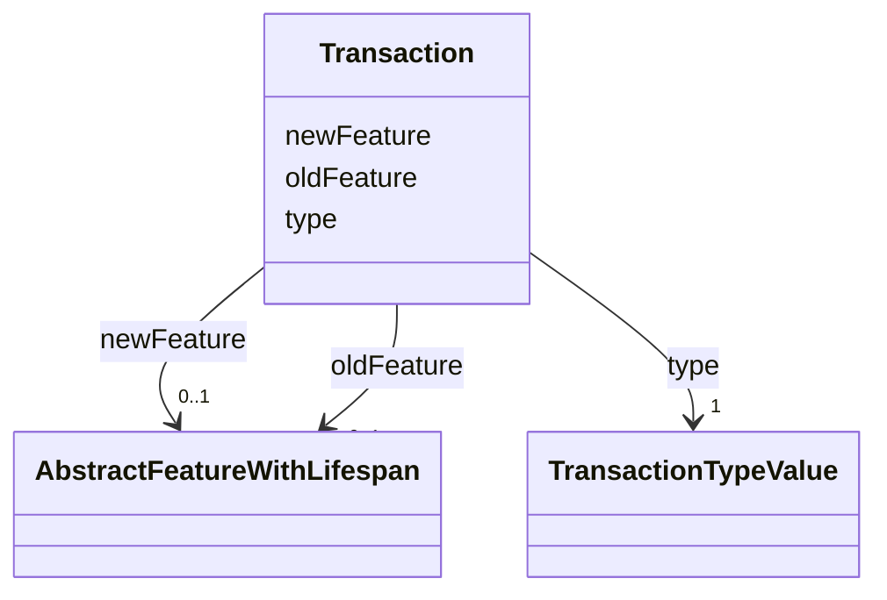

# Class: Transaction 


_Transaction represents a modification of the city model by the creation, termination, or replacement of a specific city object. While the creation of a city object also marks its first object version, the termination marks the end of existence of a real world object and, hence, also terminates the final version of a city object. The replacement of a city object means that a specific version of it is replaced by a new version._


URI: [citygml:Transaction](https://www.ogc.org/standards/citygml/Transaction)





<!-- no inheritance hierarchy -->

## Slots

| Name | Cardinality and Range | Description | Inheritance |
| ---  | --- | --- | --- |
| [type](type.md) | 1 <br/> [TransactionTypeValue](TransactionTypeValue.md) | Indicates the specific type of the Transaction | direct |
| [newFeature](newFeature.md) | 0..1 <br/> [AbstractFeatureWithLifespan](AbstractFeatureWithLifespan.md) | Relates to the version of the city object subsequent to the Transaction | direct |
| [oldFeature](oldFeature.md) | 0..1 <br/> [AbstractFeatureWithLifespan](AbstractFeatureWithLifespan.md) | Relates to the version of the city object prior to the Transaction | direct |


## Usages

| used by | used in | type | used |
| ---  | --- | --- | --- |
| [VersionTransition](VersionTransition.md) | [transaction](transaction.md) | range | [Transaction](Transaction.md) |


## Identifier and Mapping Information


### Schema Source


* from schema: https://www.ogc.org/standards/citygml


## Mappings

| Mapping Type | Mapped Value |
| ---  | ---  |
| self | citygml:Transaction |
| native | citygml:Transaction |


## LinkML Source

<!-- TODO: investigate https://stackoverflow.com/questions/37606292/how-to-create-tabbed-code-blocks-in-mkdocs-or-sphinx -->

### Direct

<details>
```yaml
name: Transaction
description: Transaction represents a modification of the city model by the creation,
  termination, or replacement of a specific city object. While the creation of a city
  object also marks its first object version, the termination marks the end of existence
  of a real world object and, hence, also terminates the final version of a city object.
  The replacement of a city object means that a specific version of it is replaced
  by a new version.
from_schema: https://www.ogc.org/standards/citygml
abstract: false
attributes:
  type:
    name: type
    description: Indicates the specific type of the Transaction.
    from_schema: https://www.ogc.org/standards/citygml
    rank: 1000
    domain_of:
    - Transaction
    - VersionTransition
    range: TransactionTypeValue
    required: true
    multivalued: false
  newFeature:
    name: newFeature
    description: Relates to the version of the city object subsequent to the Transaction.
    from_schema: https://www.ogc.org/standards/citygml
    rank: 1000
    domain_of:
    - Transaction
    range: AbstractFeatureWithLifespan
    required: false
    multivalued: false
  oldFeature:
    name: oldFeature
    description: Relates to the version of the city object prior to the Transaction.
    from_schema: https://www.ogc.org/standards/citygml
    rank: 1000
    domain_of:
    - Transaction
    range: AbstractFeatureWithLifespan
    required: false
    multivalued: false

```
</details>

### Induced

<details>
```yaml
name: Transaction
description: Transaction represents a modification of the city model by the creation,
  termination, or replacement of a specific city object. While the creation of a city
  object also marks its first object version, the termination marks the end of existence
  of a real world object and, hence, also terminates the final version of a city object.
  The replacement of a city object means that a specific version of it is replaced
  by a new version.
from_schema: https://www.ogc.org/standards/citygml
abstract: false
attributes:
  type:
    name: type
    description: Indicates the specific type of the Transaction.
    from_schema: https://www.ogc.org/standards/citygml
    rank: 1000
    alias: type
    owner: Transaction
    domain_of:
    - Transaction
    - VersionTransition
    range: TransactionTypeValue
    required: true
    multivalued: false
  newFeature:
    name: newFeature
    description: Relates to the version of the city object subsequent to the Transaction.
    from_schema: https://www.ogc.org/standards/citygml
    rank: 1000
    alias: newFeature
    owner: Transaction
    domain_of:
    - Transaction
    range: AbstractFeatureWithLifespan
    required: false
    multivalued: false
  oldFeature:
    name: oldFeature
    description: Relates to the version of the city object prior to the Transaction.
    from_schema: https://www.ogc.org/standards/citygml
    rank: 1000
    alias: oldFeature
    owner: Transaction
    domain_of:
    - Transaction
    range: AbstractFeatureWithLifespan
    required: false
    multivalued: false

```
</details>