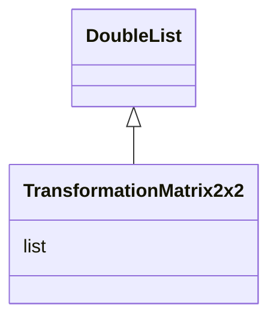

# Class: TransformationMatrix2x2 


_CityGML class from package Core_


URI: [citygml:TransformationMatrix2x2](https://www.ogc.org/standards/citygml/TransformationMatrix2x2)





## Inheritance
* [DoubleList](DoubleList.md)
    * **TransformationMatrix2x2**


## Slots

| Name | Cardinality and Range | Description | Inheritance |
| ---  | --- | --- | --- |
| [list](list.md) | 1 <br/> [Float](Float.md) |  | [DoubleList](DoubleList.md) |


## Usages

| used by | used in | type | used |
| ---  | --- | --- | --- |
| [GeoreferencedTexture](GeoreferencedTexture.md) | [orientation](orientation.md) | range | [TransformationMatrix2x2](TransformationMatrix2x2.md) |


## Identifier and Mapping Information


### Schema Source


* from schema: https://www.ogc.org/standards/citygml


## Mappings

| Mapping Type | Mapped Value |
| ---  | ---  |
| self | citygml:TransformationMatrix2x2 |
| native | citygml:TransformationMatrix2x2 |


## LinkML Source

<!-- TODO: investigate https://stackoverflow.com/questions/37606292/how-to-create-tabbed-code-blocks-in-mkdocs-or-sphinx -->

### Direct

<details>
```yaml
name: TransformationMatrix2x2
description: CityGML class from package Core
from_schema: https://www.ogc.org/standards/citygml
is_a: DoubleList
abstract: false

```
</details>

### Induced

<details>
```yaml
name: TransformationMatrix2x2
description: CityGML class from package Core
from_schema: https://www.ogc.org/standards/citygml
is_a: DoubleList
abstract: false
attributes:
  list:
    name: list
    from_schema: https://www.ogc.org/standards/citygml
    alias: list
    owner: TransformationMatrix2x2
    domain_of:
    - DoubleBetween0and1List
    - DoubleList
    - DoubleOrNilReasonList
    range: float
    required: true
    multivalued: false

```
</details>