# Class: TunnelInstallation 


_A TunnelInstallation is a permanent part of a Tunnel (inside and/or outside) which does not have the significance of a TunnelPart. In contrast to TunnelConstructiveElement, a TunnelInstallation is not essential from a structural point of view. Examples are stairs, antennas or railings._


URI: [citygml:TunnelInstallation](https://www.ogc.org/standards/citygml/TunnelInstallation)

```mermaid
 classDiagram
    class TunnelInstallation
    click TunnelInstallation href "../TunnelInstallation/"
      AbstractInstallation <|-- TunnelInstallation
        click AbstractInstallation href "../AbstractInstallation/"
      
      TunnelInstallation : adeOfAbstractCityObject
        
          
    
        
        
        TunnelInstallation --> "*" ADEOfAbstractCityObject : adeOfAbstractCityObject
        click ADEOfAbstractCityObject href "../ADEOfAbstractCityObject/"
    

        
      TunnelInstallation : adeOfAbstractFeature
        
          
    
        
        
        TunnelInstallation --> "*" ADEOfAbstractFeature : adeOfAbstractFeature
        click ADEOfAbstractFeature href "../ADEOfAbstractFeature/"
    

        
      TunnelInstallation : adeOfAbstractFeatureWithLifespan
        
          
    
        
        
        TunnelInstallation --> "*" ADEOfAbstractFeatureWithLifespan : adeOfAbstractFeatureWithLifespan
        click ADEOfAbstractFeatureWithLifespan href "../ADEOfAbstractFeatureWithLifespan/"
    

        
      TunnelInstallation : adeOfAbstractInstallation
        
          
    
        
        
        TunnelInstallation --> "*" ADEOfAbstractInstallation : adeOfAbstractInstallation
        click ADEOfAbstractInstallation href "../ADEOfAbstractInstallation/"
    

        
      TunnelInstallation : adeOfAbstractOccupiedSpace
        
          
    
        
        
        TunnelInstallation --> "*" ADEOfAbstractOccupiedSpace : adeOfAbstractOccupiedSpace
        click ADEOfAbstractOccupiedSpace href "../ADEOfAbstractOccupiedSpace/"
    

        
      TunnelInstallation : adeOfAbstractPhysicalSpace
        
          
    
        
        
        TunnelInstallation --> "*" ADEOfAbstractPhysicalSpace : adeOfAbstractPhysicalSpace
        click ADEOfAbstractPhysicalSpace href "../ADEOfAbstractPhysicalSpace/"
    

        
      TunnelInstallation : adeOfAbstractSpace
        
          
    
        
        
        TunnelInstallation --> "*" ADEOfAbstractSpace : adeOfAbstractSpace
        click ADEOfAbstractSpace href "../ADEOfAbstractSpace/"
    

        
      TunnelInstallation : adeOfTunnelInstallation
        
          
    
        
        
        TunnelInstallation --> "*" ADEOfTunnelInstallation : adeOfTunnelInstallation
        click ADEOfTunnelInstallation href "../ADEOfTunnelInstallation/"
    

        
      TunnelInstallation : appearance
        
          
    
        
        
        TunnelInstallation --> "*" AbstractAppearance : appearance
        click AbstractAppearance href "../AbstractAppearance/"
    

        
      TunnelInstallation : area
        
          
    
        
        
        TunnelInstallation --> "*" QualifiedArea : area
        click QualifiedArea href "../QualifiedArea/"
    

        
      TunnelInstallation : boundary
        
          
    
        
        
        TunnelInstallation --> "*" AbstractThematicSurface : boundary
        click AbstractThematicSurface href "../AbstractThematicSurface/"
    

        
      TunnelInstallation : class
        
          
    
        
        
        TunnelInstallation --> "0..1" TunnelInstallationClassValue : class
        click TunnelInstallationClassValue href "../TunnelInstallationClassValue/"
    

        
      TunnelInstallation : creationDate
        
      TunnelInstallation : description
        
      TunnelInstallation : dynamizer
        
          
    
        
        
        TunnelInstallation --> "*" AbstractDynamizer : dynamizer
        click AbstractDynamizer href "../AbstractDynamizer/"
    

        
      TunnelInstallation : externalReference
        
          
    
        
        
        TunnelInstallation --> "*" ExternalReference : externalReference
        click ExternalReference href "../ExternalReference/"
    

        
      TunnelInstallation : featureID
        
          
    
        
        
        TunnelInstallation --> "1" ID : featureID
        click ID href "../ID/"
    

        
      TunnelInstallation : function
        
          
    
        
        
        TunnelInstallation --> "*" TunnelInstallationFunctionValue : function
        click TunnelInstallationFunctionValue href "../TunnelInstallationFunctionValue/"
    

        
      TunnelInstallation : generalizesTo
        
          
    
        
        
        TunnelInstallation --> "*" AbstractCityObject : generalizesTo
        click AbstractCityObject href "../AbstractCityObject/"
    

        
      TunnelInstallation : genericAttribute
        
          
    
        
        
        TunnelInstallation --> "*" AbstractGenericAttribute : genericAttribute
        click AbstractGenericAttribute href "../AbstractGenericAttribute/"
    

        
      TunnelInstallation : identifier
        
      TunnelInstallation : lod0MultiCurve
        
      TunnelInstallation : lod0MultiSurface
        
      TunnelInstallation : lod0Point
        
      TunnelInstallation : lod1ImplicitRepresentation
        
          
    
        
        
        TunnelInstallation --> "0..1" ImplicitGeometry : lod1ImplicitRepresentation
        click ImplicitGeometry href "../ImplicitGeometry/"
    

        
      TunnelInstallation : lod1Solid
        
      TunnelInstallation : lod1TerrainIntersectionCurve
        
      TunnelInstallation : lod2ImplicitRepresentation
        
          
    
        
        
        TunnelInstallation --> "0..1" ImplicitGeometry : lod2ImplicitRepresentation
        click ImplicitGeometry href "../ImplicitGeometry/"
    

        
      TunnelInstallation : lod2MultiCurve
        
      TunnelInstallation : lod2MultiSurface
        
      TunnelInstallation : lod2Solid
        
      TunnelInstallation : lod2TerrainIntersectionCurve
        
      TunnelInstallation : lod3ImplicitRepresentation
        
          
    
        
        
        TunnelInstallation --> "0..1" ImplicitGeometry : lod3ImplicitRepresentation
        click ImplicitGeometry href "../ImplicitGeometry/"
    

        
      TunnelInstallation : lod3MultiCurve
        
      TunnelInstallation : lod3MultiSurface
        
      TunnelInstallation : lod3Solid
        
      TunnelInstallation : lod3TerrainIntersectionCurve
        
      TunnelInstallation : name
        
      TunnelInstallation : pointCloud
        
          
    
        
        
        TunnelInstallation --> "0..1" AbstractPointCloud : pointCloud
        click AbstractPointCloud href "../AbstractPointCloud/"
    

        
      TunnelInstallation : relatedTo
        
          
    
        
        
        TunnelInstallation --> "*" AbstractCityObject : relatedTo
        click AbstractCityObject href "../AbstractCityObject/"
    

        
      TunnelInstallation : relationToConstruction
        
          
    
        
        
        TunnelInstallation --> "0..1" RelationToConstruction : relationToConstruction
        click RelationToConstruction href "../RelationToConstruction/"
    

        
      TunnelInstallation : relativeToTerrain
        
          
    
        
        
        TunnelInstallation --> "0..1" RelativeToTerrain : relativeToTerrain
        click RelativeToTerrain href "../RelativeToTerrain/"
    

        
      TunnelInstallation : relativeToWater
        
          
    
        
        
        TunnelInstallation --> "0..1" RelativeToWater : relativeToWater
        click RelativeToWater href "../RelativeToWater/"
    

        
      TunnelInstallation : spaceType
        
          
    
        
        
        TunnelInstallation --> "0..1" SpaceType : spaceType
        click SpaceType href "../SpaceType/"
    

        
      TunnelInstallation : terminationDate
        
      TunnelInstallation : usage
        
          
    
        
        
        TunnelInstallation --> "*" TunnelInstallationUsageValue : usage
        click TunnelInstallationUsageValue href "../TunnelInstallationUsageValue/"
    

        
      TunnelInstallation : validFrom
        
      TunnelInstallation : validTo
        
      TunnelInstallation : volume
        
          
    
        
        
        TunnelInstallation --> "*" QualifiedVolume : volume
        click QualifiedVolume href "../QualifiedVolume/"
    

        
      
```





## Inheritance
* [AbstractFeature](AbstractFeature.md)
    * [AbstractFeatureWithLifespan](AbstractFeatureWithLifespan.md)
        * [AbstractCityObject](AbstractCityObject.md)
            * [AbstractSpace](AbstractSpace.md)
                * [AbstractPhysicalSpace](AbstractPhysicalSpace.md)
                    * [AbstractOccupiedSpace](AbstractOccupiedSpace.md)
                        * [AbstractInstallation](AbstractInstallation.md)
                            * **TunnelInstallation**


## Slots

| Name | Cardinality and Range | Description | Inheritance |
| ---  | --- | --- | --- |
| [class](class.md) | 0..1 <br/> [TunnelInstallationClassValue](TunnelInstallationClassValue.md) | Indicates the specific type of the TunnelInstallation | direct |
| [function](function.md) | * <br/> [TunnelInstallationFunctionValue](TunnelInstallationFunctionValue.md) | Specifies the intended purposes of the TunnelInstallation | direct |
| [usage](usage.md) | * <br/> [TunnelInstallationUsageValue](TunnelInstallationUsageValue.md) | Specifies the actual uses of the TunnelInstallation | direct |
| [adeOfTunnelInstallation](adeOfTunnelInstallation.md) | * <br/> [ADEOfTunnelInstallation](ADEOfTunnelInstallation.md) | Augments the TunnelInstallation with properties defined in an ADE | direct |
| [relationToConstruction](relationToConstruction.md) | 0..1 <br/> [RelationToConstruction](RelationToConstruction.md) | Indicates whether the installation is located inside and/or outside of the co... | [AbstractInstallation](AbstractInstallation.md) |
| [adeOfAbstractInstallation](adeOfAbstractInstallation.md) | * <br/> [ADEOfAbstractInstallation](ADEOfAbstractInstallation.md) | Augments AbstractInstallation with properties defined in an ADE | [AbstractInstallation](AbstractInstallation.md) |
| [boundary](boundary.md) | * <br/> [AbstractThematicSurface](AbstractThematicSurface.md) |  | [AbstractSpace](AbstractSpace.md), [AbstractInstallation](AbstractInstallation.md) |
| [adeOfAbstractOccupiedSpace](adeOfAbstractOccupiedSpace.md) | * <br/> [ADEOfAbstractOccupiedSpace](ADEOfAbstractOccupiedSpace.md) | Augments AbstractOccupiedSpace with properties defined in an ADE | [AbstractOccupiedSpace](AbstractOccupiedSpace.md) |
| [lod3ImplicitRepresentation](lod3ImplicitRepresentation.md) | 0..1 <br/> [ImplicitGeometry](ImplicitGeometry.md) | Relates to an implicit geometry that represents the occupied space in Level o... | [AbstractOccupiedSpace](AbstractOccupiedSpace.md) |
| [lod2ImplicitRepresentation](lod2ImplicitRepresentation.md) | 0..1 <br/> [ImplicitGeometry](ImplicitGeometry.md) | Relates to an implicit geometry that represents the occupied space in Level o... | [AbstractOccupiedSpace](AbstractOccupiedSpace.md) |
| [lod1ImplicitRepresentation](lod1ImplicitRepresentation.md) | 0..1 <br/> [ImplicitGeometry](ImplicitGeometry.md) | Relates to an implicit geometry that represents the occupied space in Level o... | [AbstractOccupiedSpace](AbstractOccupiedSpace.md) |
| [adeOfAbstractPhysicalSpace](adeOfAbstractPhysicalSpace.md) | * <br/> [ADEOfAbstractPhysicalSpace](ADEOfAbstractPhysicalSpace.md) | Augments AbstractPhysicalSpace with properties defined in an ADE | [AbstractPhysicalSpace](AbstractPhysicalSpace.md) |
| [lod3TerrainIntersectionCurve](lod3TerrainIntersectionCurve.md) | 0..1 <br/> [String](String.md) | Relates to a 3D MultiCurve geometry that represents the terrain intersection ... | [AbstractPhysicalSpace](AbstractPhysicalSpace.md) |
| [pointCloud](pointCloud.md) | 0..1 <br/> [AbstractPointCloud](AbstractPointCloud.md) | Relates to a 3D PointCloud that represents the physical space | [AbstractPhysicalSpace](AbstractPhysicalSpace.md) |
| [lod1TerrainIntersectionCurve](lod1TerrainIntersectionCurve.md) | 0..1 <br/> [String](String.md) | Relates to a 3D MultiCurve geometry that represents the terrain intersection ... | [AbstractPhysicalSpace](AbstractPhysicalSpace.md) |
| [lod2TerrainIntersectionCurve](lod2TerrainIntersectionCurve.md) | 0..1 <br/> [String](String.md) | Relates to a 3D MultiCurve geometry that represents the terrain intersection ... | [AbstractPhysicalSpace](AbstractPhysicalSpace.md) |
| [spaceType](spaceType.md) | 0..1 <br/> [SpaceType](SpaceType.md) | Specifies the degree of openness of a space | [AbstractSpace](AbstractSpace.md) |
| [volume](volume.md) | * <br/> [QualifiedVolume](QualifiedVolume.md) | Specifies qualified volumes related to the space | [AbstractSpace](AbstractSpace.md) |
| [area](area.md) | * <br/> [QualifiedArea](QualifiedArea.md) | Specifies qualified areas related to the space | [AbstractSpace](AbstractSpace.md) |
| [adeOfAbstractSpace](adeOfAbstractSpace.md) | * <br/> [ADEOfAbstractSpace](ADEOfAbstractSpace.md) | Augments AbstractSpace with properties defined in an ADE | [AbstractSpace](AbstractSpace.md) |
| [lod2MultiCurve](lod2MultiCurve.md) | 0..1 <br/> [String](String.md) | Relates to a 3D MultiCurve geometry that represents the space in Level of Det... | [AbstractSpace](AbstractSpace.md) |
| [lod3MultiSurface](lod3MultiSurface.md) | 0..1 <br/> [String](String.md) | Relates to a 3D MultiSurface geometry that represents the space in Level of D... | [AbstractSpace](AbstractSpace.md) |
| [lod0MultiSurface](lod0MultiSurface.md) | 0..1 <br/> [String](String.md) | Relates to a 3D MultiSurface geometry that represents the space in Level of D... | [AbstractSpace](AbstractSpace.md) |
| [lod1Solid](lod1Solid.md) | 0..1 <br/> [String](String.md) | Relates to a 3D Solid geometry that represents the space in Level of Detail 1 | [AbstractSpace](AbstractSpace.md) |
| [lod3Solid](lod3Solid.md) | 0..1 <br/> [String](String.md) | Relates to a 3D Solid geometry that represents the space in Level of Detail 3 | [AbstractSpace](AbstractSpace.md) |
| [lod0MultiCurve](lod0MultiCurve.md) | 0..1 <br/> [String](String.md) | Relates to a 3D MultiCurve geometry that represents the space in Level of Det... | [AbstractSpace](AbstractSpace.md) |
| [lod2Solid](lod2Solid.md) | 0..1 <br/> [String](String.md) | Relates to a 3D Solid geometry that represents the space in Level of Detail 2 | [AbstractSpace](AbstractSpace.md) |
| [lod0Point](lod0Point.md) | 0..1 <br/> [String](String.md) | Relates to a 3D Point geometry that represents the space in Level of Detail 0 | [AbstractSpace](AbstractSpace.md) |
| [lod3MultiCurve](lod3MultiCurve.md) | 0..1 <br/> [String](String.md) | Relates to a 3D MultiCurve geometry that represents the space in Level of Det... | [AbstractSpace](AbstractSpace.md) |
| [lod2MultiSurface](lod2MultiSurface.md) | 0..1 <br/> [String](String.md) | Relates to a 3D MultiSurface geometry that represents the space in Level of D... | [AbstractSpace](AbstractSpace.md) |
| [relativeToTerrain](relativeToTerrain.md) | 0..1 <br/> [RelativeToTerrain](RelativeToTerrain.md) | Describes the vertical position of the city object relative to the surroundin... | [AbstractCityObject](AbstractCityObject.md) |
| [relativeToWater](relativeToWater.md) | 0..1 <br/> [RelativeToWater](RelativeToWater.md) | Describes the vertical position of the city object relative to the surroundin... | [AbstractCityObject](AbstractCityObject.md) |
| [adeOfAbstractCityObject](adeOfAbstractCityObject.md) | * <br/> [ADEOfAbstractCityObject](ADEOfAbstractCityObject.md) | Augments AbstractCityObject with properties defined in an ADE | [AbstractCityObject](AbstractCityObject.md) |
| [appearance](appearance.md) | * <br/> [AbstractAppearance](AbstractAppearance.md) | Relates appearances to the city object | [AbstractCityObject](AbstractCityObject.md) |
| [genericAttribute](genericAttribute.md) | * <br/> [AbstractGenericAttribute](AbstractGenericAttribute.md) | Relates generic attributes to the city object | [AbstractCityObject](AbstractCityObject.md) |
| [generalizesTo](generalizesTo.md) | * <br/> [AbstractCityObject](AbstractCityObject.md) | Relates generalized representations of the same real-world object in differen... | [AbstractCityObject](AbstractCityObject.md) |
| [externalReference](externalReference.md) | * <br/> [ExternalReference](ExternalReference.md) | References external objects in other information systems that have a relation... | [AbstractCityObject](AbstractCityObject.md) |
| [relatedTo](relatedTo.md) | * <br/> [AbstractCityObject](AbstractCityObject.md) |  | [AbstractCityObject](AbstractCityObject.md) |
| [dynamizer](dynamizer.md) | * <br/> [AbstractDynamizer](AbstractDynamizer.md) | Relates Dynamizer objects to the city object | [AbstractCityObject](AbstractCityObject.md) |
| [creationDate](creationDate.md) | 0..1 <br/> [Datetime](Datetime.md) | Indicates the date at which a CityGML feature was added to the CityModel | [AbstractFeatureWithLifespan](AbstractFeatureWithLifespan.md) |
| [terminationDate](terminationDate.md) | 0..1 <br/> [Datetime](Datetime.md) | Indicates the date at which a CityGML feature was removed from the CityModel | [AbstractFeatureWithLifespan](AbstractFeatureWithLifespan.md) |
| [validFrom](validFrom.md) | 0..1 <br/> [Datetime](Datetime.md) | Indicates the date at which a CityGML feature started to exist in the real wo... | [AbstractFeatureWithLifespan](AbstractFeatureWithLifespan.md) |
| [validTo](validTo.md) | 0..1 <br/> [Datetime](Datetime.md) | Indicates the date at which a CityGML feature ended to exist in the real worl... | [AbstractFeatureWithLifespan](AbstractFeatureWithLifespan.md) |
| [adeOfAbstractFeatureWithLifespan](adeOfAbstractFeatureWithLifespan.md) | * <br/> [ADEOfAbstractFeatureWithLifespan](ADEOfAbstractFeatureWithLifespan.md) | Augments AbstractFeatureWithLifespan with properties defined in an ADE | [AbstractFeatureWithLifespan](AbstractFeatureWithLifespan.md) |
| [featureID](featureID.md) | 1 <br/> [ID](ID.md) |  | [AbstractFeature](AbstractFeature.md) |
| [identifier](identifier.md) | 0..1 <br/> [String](String.md) |  | [AbstractFeature](AbstractFeature.md) |
| [name](name.md) | * <br/> [String](String.md) |  | [AbstractFeature](AbstractFeature.md) |
| [description](description.md) | 0..1 <br/> [String](String.md) |  | [AbstractFeature](AbstractFeature.md) |
| [adeOfAbstractFeature](adeOfAbstractFeature.md) | * <br/> [ADEOfAbstractFeature](ADEOfAbstractFeature.md) | Augments AbstractFeature with properties defined in an ADE | [AbstractFeature](AbstractFeature.md) |


## Usages

| used by | used in | type | used |
| ---  | --- | --- | --- |
| [AbstractTunnel](AbstractTunnel.md) | [tunnelInstallation](tunnelInstallation.md) | range | [TunnelInstallation](TunnelInstallation.md) |
| [HollowSpace](HollowSpace.md) | [tunnelInstallation](tunnelInstallation.md) | range | [TunnelInstallation](TunnelInstallation.md) |
| [Tunnel](Tunnel.md) | [tunnelInstallation](tunnelInstallation.md) | range | [TunnelInstallation](TunnelInstallation.md) |
| [TunnelPart](TunnelPart.md) | [tunnelInstallation](tunnelInstallation.md) | range | [TunnelInstallation](TunnelInstallation.md) |


## Identifier and Mapping Information


### Schema Source


* from schema: https://www.ogc.org/standards/citygml


## Mappings

| Mapping Type | Mapped Value |
| ---  | ---  |
| self | citygml:TunnelInstallation |
| native | citygml:TunnelInstallation |


## LinkML Source

<!-- TODO: investigate https://stackoverflow.com/questions/37606292/how-to-create-tabbed-code-blocks-in-mkdocs-or-sphinx -->

### Direct

<details>
```yaml
name: TunnelInstallation
description: A TunnelInstallation is a permanent part of a Tunnel (inside and/or outside)
  which does not have the significance of a TunnelPart. In contrast to TunnelConstructiveElement,
  a TunnelInstallation is not essential from a structural point of view. Examples
  are stairs, antennas or railings.
from_schema: https://www.ogc.org/standards/citygml
is_a: AbstractInstallation
abstract: false
attributes:
  class:
    name: class
    description: Indicates the specific type of the TunnelInstallation.
    from_schema: https://www.ogc.org/standards/citygml
    domain_of:
    - Door
    - OtherConstruction
    - Window
    - AbstractBridge
    - BridgeConstructiveElement
    - BridgeFurniture
    - BridgeInstallation
    - BridgeRoom
    - AbstractBuilding
    - AbstractBuildingSubdivision
    - BuildingConstructiveElement
    - BuildingFurniture
    - BuildingInstallation
    - BuildingRoom
    - CityFurniture
    - CityObjectGroup
    - GenericLogicalSpace
    - GenericOccupiedSpace
    - GenericThematicSurface
    - GenericUnoccupiedSpace
    - LandUse
    - AuxiliaryTrafficArea
    - AuxiliaryTrafficSpace
    - ClearanceSpace
    - Hole
    - Intersection
    - Marking
    - Railway
    - Road
    - Section
    - Square
    - Track
    - TrafficArea
    - TrafficSpace
    - Waterway
    - AbstractTunnel
    - HollowSpace
    - TunnelConstructiveElement
    - TunnelFurniture
    - TunnelInstallation
    - PlantCover
    - SolitaryVegetationObject
    - WaterBody
    range: TunnelInstallationClassValue
    required: false
    multivalued: false
  function:
    name: function
    description: Specifies the intended purposes of the TunnelInstallation.
    from_schema: https://www.ogc.org/standards/citygml
    domain_of:
    - Door
    - OtherConstruction
    - Window
    - AbstractBridge
    - BridgeConstructiveElement
    - BridgeFurniture
    - BridgeInstallation
    - BridgeRoom
    - AbstractBuilding
    - AbstractBuildingSubdivision
    - BuildingConstructiveElement
    - BuildingFurniture
    - BuildingInstallation
    - BuildingRoom
    - CityFurniture
    - CityObjectGroup
    - GenericLogicalSpace
    - GenericOccupiedSpace
    - GenericThematicSurface
    - GenericUnoccupiedSpace
    - LandUse
    - AuxiliaryTrafficArea
    - AuxiliaryTrafficSpace
    - Railway
    - Road
    - Square
    - Track
    - TrafficArea
    - TrafficSpace
    - Waterway
    - AbstractTunnel
    - HollowSpace
    - TunnelConstructiveElement
    - TunnelFurniture
    - TunnelInstallation
    - PlantCover
    - SolitaryVegetationObject
    - WaterBody
    range: TunnelInstallationFunctionValue
    required: false
    multivalued: true
  usage:
    name: usage
    description: Specifies the actual uses of the TunnelInstallation.
    from_schema: https://www.ogc.org/standards/citygml
    domain_of:
    - Door
    - OtherConstruction
    - Window
    - AbstractBridge
    - BridgeConstructiveElement
    - BridgeFurniture
    - BridgeInstallation
    - BridgeRoom
    - AbstractBuilding
    - AbstractBuildingSubdivision
    - BuildingConstructiveElement
    - BuildingFurniture
    - BuildingInstallation
    - BuildingRoom
    - CityFurniture
    - CityObjectGroup
    - GenericLogicalSpace
    - GenericOccupiedSpace
    - GenericThematicSurface
    - GenericUnoccupiedSpace
    - LandUse
    - AuxiliaryTrafficArea
    - AuxiliaryTrafficSpace
    - Railway
    - Road
    - Square
    - Track
    - TrafficArea
    - TrafficSpace
    - Waterway
    - AbstractTunnel
    - HollowSpace
    - TunnelConstructiveElement
    - TunnelFurniture
    - TunnelInstallation
    - PlantCover
    - SolitaryVegetationObject
    - WaterBody
    range: TunnelInstallationUsageValue
    required: false
    multivalued: true
  adeOfTunnelInstallation:
    name: adeOfTunnelInstallation
    description: Augments the TunnelInstallation with properties defined in an ADE.
    from_schema: https://www.ogc.org/standards/citygml
    rank: 1000
    domain_of:
    - TunnelInstallation
    range: ADEOfTunnelInstallation
    required: false
    multivalued: true

```
</details>

### Induced

<details>
```yaml
name: TunnelInstallation
description: A TunnelInstallation is a permanent part of a Tunnel (inside and/or outside)
  which does not have the significance of a TunnelPart. In contrast to TunnelConstructiveElement,
  a TunnelInstallation is not essential from a structural point of view. Examples
  are stairs, antennas or railings.
from_schema: https://www.ogc.org/standards/citygml
is_a: AbstractInstallation
abstract: false
attributes:
  class:
    name: class
    description: Indicates the specific type of the TunnelInstallation.
    from_schema: https://www.ogc.org/standards/citygml
    alias: class
    owner: TunnelInstallation
    domain_of:
    - Door
    - OtherConstruction
    - Window
    - AbstractBridge
    - BridgeConstructiveElement
    - BridgeFurniture
    - BridgeInstallation
    - BridgeRoom
    - AbstractBuilding
    - AbstractBuildingSubdivision
    - BuildingConstructiveElement
    - BuildingFurniture
    - BuildingInstallation
    - BuildingRoom
    - CityFurniture
    - CityObjectGroup
    - GenericLogicalSpace
    - GenericOccupiedSpace
    - GenericThematicSurface
    - GenericUnoccupiedSpace
    - LandUse
    - AuxiliaryTrafficArea
    - AuxiliaryTrafficSpace
    - ClearanceSpace
    - Hole
    - Intersection
    - Marking
    - Railway
    - Road
    - Section
    - Square
    - Track
    - TrafficArea
    - TrafficSpace
    - Waterway
    - AbstractTunnel
    - HollowSpace
    - TunnelConstructiveElement
    - TunnelFurniture
    - TunnelInstallation
    - PlantCover
    - SolitaryVegetationObject
    - WaterBody
    range: TunnelInstallationClassValue
    required: false
    multivalued: false
  function:
    name: function
    description: Specifies the intended purposes of the TunnelInstallation.
    from_schema: https://www.ogc.org/standards/citygml
    alias: function
    owner: TunnelInstallation
    domain_of:
    - Door
    - OtherConstruction
    - Window
    - AbstractBridge
    - BridgeConstructiveElement
    - BridgeFurniture
    - BridgeInstallation
    - BridgeRoom
    - AbstractBuilding
    - AbstractBuildingSubdivision
    - BuildingConstructiveElement
    - BuildingFurniture
    - BuildingInstallation
    - BuildingRoom
    - CityFurniture
    - CityObjectGroup
    - GenericLogicalSpace
    - GenericOccupiedSpace
    - GenericThematicSurface
    - GenericUnoccupiedSpace
    - LandUse
    - AuxiliaryTrafficArea
    - AuxiliaryTrafficSpace
    - Railway
    - Road
    - Square
    - Track
    - TrafficArea
    - TrafficSpace
    - Waterway
    - AbstractTunnel
    - HollowSpace
    - TunnelConstructiveElement
    - TunnelFurniture
    - TunnelInstallation
    - PlantCover
    - SolitaryVegetationObject
    - WaterBody
    range: TunnelInstallationFunctionValue
    required: false
    multivalued: true
  usage:
    name: usage
    description: Specifies the actual uses of the TunnelInstallation.
    from_schema: https://www.ogc.org/standards/citygml
    alias: usage
    owner: TunnelInstallation
    domain_of:
    - Door
    - OtherConstruction
    - Window
    - AbstractBridge
    - BridgeConstructiveElement
    - BridgeFurniture
    - BridgeInstallation
    - BridgeRoom
    - AbstractBuilding
    - AbstractBuildingSubdivision
    - BuildingConstructiveElement
    - BuildingFurniture
    - BuildingInstallation
    - BuildingRoom
    - CityFurniture
    - CityObjectGroup
    - GenericLogicalSpace
    - GenericOccupiedSpace
    - GenericThematicSurface
    - GenericUnoccupiedSpace
    - LandUse
    - AuxiliaryTrafficArea
    - AuxiliaryTrafficSpace
    - Railway
    - Road
    - Square
    - Track
    - TrafficArea
    - TrafficSpace
    - Waterway
    - AbstractTunnel
    - HollowSpace
    - TunnelConstructiveElement
    - TunnelFurniture
    - TunnelInstallation
    - PlantCover
    - SolitaryVegetationObject
    - WaterBody
    range: TunnelInstallationUsageValue
    required: false
    multivalued: true
  adeOfTunnelInstallation:
    name: adeOfTunnelInstallation
    description: Augments the TunnelInstallation with properties defined in an ADE.
    from_schema: https://www.ogc.org/standards/citygml
    rank: 1000
    alias: adeOfTunnelInstallation
    owner: TunnelInstallation
    domain_of:
    - TunnelInstallation
    range: ADEOfTunnelInstallation
    required: false
    multivalued: true
  relationToConstruction:
    name: relationToConstruction
    description: Indicates whether the installation is located inside and/or outside
      of the construction.
    from_schema: https://www.ogc.org/standards/citygml
    rank: 1000
    alias: relationToConstruction
    owner: TunnelInstallation
    domain_of:
    - AbstractInstallation
    range: RelationToConstruction
    required: false
    multivalued: false
  adeOfAbstractInstallation:
    name: adeOfAbstractInstallation
    description: Augments AbstractInstallation with properties defined in an ADE.
    from_schema: https://www.ogc.org/standards/citygml
    rank: 1000
    alias: adeOfAbstractInstallation
    owner: TunnelInstallation
    domain_of:
    - AbstractInstallation
    range: ADEOfAbstractInstallation
    required: false
    multivalued: true
  boundary:
    name: boundary
    from_schema: https://www.ogc.org/standards/citygml
    alias: boundary
    owner: TunnelInstallation
    domain_of:
    - AbstractConstruction
    - AbstractConstructiveElement
    - AbstractInstallation
    - Door
    - Window
    - BridgeRoom
    - BuildingRoom
    - Storey
    - AbstractSpace
    - AuxiliaryTrafficSpace
    - Hole
    - TrafficSpace
    - HollowSpace
    - WaterBody
    range: AbstractThematicSurface
    required: false
    multivalued: true
  adeOfAbstractOccupiedSpace:
    name: adeOfAbstractOccupiedSpace
    description: Augments AbstractOccupiedSpace with properties defined in an ADE.
    from_schema: https://www.ogc.org/standards/citygml
    rank: 1000
    alias: adeOfAbstractOccupiedSpace
    owner: TunnelInstallation
    domain_of:
    - AbstractOccupiedSpace
    range: ADEOfAbstractOccupiedSpace
    required: false
    multivalued: true
  lod3ImplicitRepresentation:
    name: lod3ImplicitRepresentation
    description: Relates to an implicit geometry that represents the occupied space
      in Level of Detail 3.
    from_schema: https://www.ogc.org/standards/citygml
    rank: 1000
    alias: lod3ImplicitRepresentation
    owner: TunnelInstallation
    domain_of:
    - AbstractOccupiedSpace
    range: ImplicitGeometry
    required: false
    multivalued: false
  lod2ImplicitRepresentation:
    name: lod2ImplicitRepresentation
    description: Relates to an implicit geometry that represents the occupied space
      in Level of Detail 2.
    from_schema: https://www.ogc.org/standards/citygml
    rank: 1000
    alias: lod2ImplicitRepresentation
    owner: TunnelInstallation
    domain_of:
    - AbstractOccupiedSpace
    range: ImplicitGeometry
    required: false
    multivalued: false
  lod1ImplicitRepresentation:
    name: lod1ImplicitRepresentation
    description: Relates to an implicit geometry that represents the occupied space
      in Level of Detail 1.
    from_schema: https://www.ogc.org/standards/citygml
    rank: 1000
    alias: lod1ImplicitRepresentation
    owner: TunnelInstallation
    domain_of:
    - AbstractOccupiedSpace
    range: ImplicitGeometry
    required: false
    multivalued: false
  adeOfAbstractPhysicalSpace:
    name: adeOfAbstractPhysicalSpace
    description: Augments AbstractPhysicalSpace with properties defined in an ADE.
    from_schema: https://www.ogc.org/standards/citygml
    rank: 1000
    alias: adeOfAbstractPhysicalSpace
    owner: TunnelInstallation
    domain_of:
    - AbstractPhysicalSpace
    range: ADEOfAbstractPhysicalSpace
    required: false
    multivalued: true
  lod3TerrainIntersectionCurve:
    name: lod3TerrainIntersectionCurve
    description: Relates to a 3D MultiCurve geometry that represents the terrain intersection
      curve of the physical space in Level of Detail 3.
    from_schema: https://www.ogc.org/standards/citygml
    rank: 1000
    alias: lod3TerrainIntersectionCurve
    owner: TunnelInstallation
    domain_of:
    - AbstractPhysicalSpace
    range: string
    required: false
    multivalued: false
  pointCloud:
    name: pointCloud
    description: Relates to a 3D PointCloud that represents the physical space.
    from_schema: https://www.ogc.org/standards/citygml
    rank: 1000
    alias: pointCloud
    owner: TunnelInstallation
    domain_of:
    - AbstractPhysicalSpace
    - AbstractThematicSurface
    - MassPointRelief
    range: AbstractPointCloud
    required: false
    multivalued: false
  lod1TerrainIntersectionCurve:
    name: lod1TerrainIntersectionCurve
    description: Relates to a 3D MultiCurve geometry that represents the terrain intersection
      curve of the physical space in Level of Detail 1.
    from_schema: https://www.ogc.org/standards/citygml
    rank: 1000
    alias: lod1TerrainIntersectionCurve
    owner: TunnelInstallation
    domain_of:
    - AbstractPhysicalSpace
    range: string
    required: false
    multivalued: false
  lod2TerrainIntersectionCurve:
    name: lod2TerrainIntersectionCurve
    description: Relates to a 3D MultiCurve geometry that represents the terrain intersection
      curve of the physical space in Level of Detail 2.
    from_schema: https://www.ogc.org/standards/citygml
    rank: 1000
    alias: lod2TerrainIntersectionCurve
    owner: TunnelInstallation
    domain_of:
    - AbstractPhysicalSpace
    range: string
    required: false
    multivalued: false
  spaceType:
    name: spaceType
    description: Specifies the degree of openness of a space.
    from_schema: https://www.ogc.org/standards/citygml
    rank: 1000
    alias: spaceType
    owner: TunnelInstallation
    domain_of:
    - AbstractSpace
    range: SpaceType
    required: false
    multivalued: false
  volume:
    name: volume
    description: Specifies qualified volumes related to the space.
    from_schema: https://www.ogc.org/standards/citygml
    alias: volume
    owner: TunnelInstallation
    domain_of:
    - QualifiedVolume
    - AbstractSpace
    range: QualifiedVolume
    required: false
    multivalued: true
  area:
    name: area
    description: Specifies qualified areas related to the space.
    from_schema: https://www.ogc.org/standards/citygml
    alias: area
    owner: TunnelInstallation
    domain_of:
    - QualifiedArea
    - AbstractSpace
    - AbstractThematicSurface
    range: QualifiedArea
    required: false
    multivalued: true
  adeOfAbstractSpace:
    name: adeOfAbstractSpace
    description: Augments AbstractSpace with properties defined in an ADE.
    from_schema: https://www.ogc.org/standards/citygml
    rank: 1000
    alias: adeOfAbstractSpace
    owner: TunnelInstallation
    domain_of:
    - AbstractSpace
    range: ADEOfAbstractSpace
    required: false
    multivalued: true
  lod2MultiCurve:
    name: lod2MultiCurve
    description: Relates to a 3D MultiCurve geometry that represents the space in
      Level of Detail 2.
    from_schema: https://www.ogc.org/standards/citygml
    rank: 1000
    alias: lod2MultiCurve
    owner: TunnelInstallation
    domain_of:
    - AbstractSpace
    range: string
    required: false
    multivalued: false
  lod3MultiSurface:
    name: lod3MultiSurface
    description: Relates to a 3D MultiSurface geometry that represents the space in
      Level of Detail 3.
    from_schema: https://www.ogc.org/standards/citygml
    rank: 1000
    alias: lod3MultiSurface
    owner: TunnelInstallation
    domain_of:
    - AbstractSpace
    - AbstractThematicSurface
    range: string
    required: false
    multivalued: false
  lod0MultiSurface:
    name: lod0MultiSurface
    description: Relates to a 3D MultiSurface geometry that represents the space in
      Level of Detail 0.
    from_schema: https://www.ogc.org/standards/citygml
    rank: 1000
    alias: lod0MultiSurface
    owner: TunnelInstallation
    domain_of:
    - AbstractSpace
    - AbstractThematicSurface
    range: string
    required: false
    multivalued: false
  lod1Solid:
    name: lod1Solid
    description: Relates to a 3D Solid geometry that represents the space in Level
      of Detail 1.
    from_schema: https://www.ogc.org/standards/citygml
    rank: 1000
    alias: lod1Solid
    owner: TunnelInstallation
    domain_of:
    - AbstractSpace
    range: string
    required: false
    multivalued: false
  lod3Solid:
    name: lod3Solid
    description: Relates to a 3D Solid geometry that represents the space in Level
      of Detail 3.
    from_schema: https://www.ogc.org/standards/citygml
    rank: 1000
    alias: lod3Solid
    owner: TunnelInstallation
    domain_of:
    - AbstractSpace
    range: string
    required: false
    multivalued: false
  lod0MultiCurve:
    name: lod0MultiCurve
    description: Relates to a 3D MultiCurve geometry that represents the space in
      Level of Detail 0.
    from_schema: https://www.ogc.org/standards/citygml
    rank: 1000
    alias: lod0MultiCurve
    owner: TunnelInstallation
    domain_of:
    - AbstractSpace
    - AbstractThematicSurface
    range: string
    required: false
    multivalued: false
  lod2Solid:
    name: lod2Solid
    description: Relates to a 3D Solid geometry that represents the space in Level
      of Detail 2.
    from_schema: https://www.ogc.org/standards/citygml
    rank: 1000
    alias: lod2Solid
    owner: TunnelInstallation
    domain_of:
    - AbstractSpace
    range: string
    required: false
    multivalued: false
  lod0Point:
    name: lod0Point
    description: Relates to a 3D Point geometry that represents the space in Level
      of Detail 0.
    from_schema: https://www.ogc.org/standards/citygml
    rank: 1000
    alias: lod0Point
    owner: TunnelInstallation
    domain_of:
    - AbstractSpace
    range: string
    required: false
    multivalued: false
  lod3MultiCurve:
    name: lod3MultiCurve
    description: Relates to a 3D MultiCurve geometry that represents the space in
      Level of Detail 3.
    from_schema: https://www.ogc.org/standards/citygml
    rank: 1000
    alias: lod3MultiCurve
    owner: TunnelInstallation
    domain_of:
    - AbstractSpace
    range: string
    required: false
    multivalued: false
  lod2MultiSurface:
    name: lod2MultiSurface
    description: Relates to a 3D MultiSurface geometry that represents the space in
      Level of Detail 2.
    from_schema: https://www.ogc.org/standards/citygml
    rank: 1000
    alias: lod2MultiSurface
    owner: TunnelInstallation
    domain_of:
    - AbstractSpace
    - AbstractThematicSurface
    range: string
    required: false
    multivalued: false
  relativeToTerrain:
    name: relativeToTerrain
    description: Describes the vertical position of the city object relative to the
      surrounding terrain.
    from_schema: https://www.ogc.org/standards/citygml
    rank: 1000
    alias: relativeToTerrain
    owner: TunnelInstallation
    domain_of:
    - AbstractCityObject
    range: RelativeToTerrain
    required: false
    multivalued: false
  relativeToWater:
    name: relativeToWater
    description: Describes the vertical position of the city object relative to the
      surrounding water surface.
    from_schema: https://www.ogc.org/standards/citygml
    rank: 1000
    alias: relativeToWater
    owner: TunnelInstallation
    domain_of:
    - AbstractCityObject
    range: RelativeToWater
    required: false
    multivalued: false
  adeOfAbstractCityObject:
    name: adeOfAbstractCityObject
    description: Augments AbstractCityObject with properties defined in an ADE.
    from_schema: https://www.ogc.org/standards/citygml
    rank: 1000
    alias: adeOfAbstractCityObject
    owner: TunnelInstallation
    domain_of:
    - AbstractCityObject
    range: ADEOfAbstractCityObject
    required: false
    multivalued: true
  appearance:
    name: appearance
    description: Relates appearances to the city object.
    from_schema: https://www.ogc.org/standards/citygml
    rank: 1000
    alias: appearance
    owner: TunnelInstallation
    domain_of:
    - AbstractCityObject
    - ImplicitGeometry
    range: AbstractAppearance
    required: false
    multivalued: true
  genericAttribute:
    name: genericAttribute
    description: Relates generic attributes to the city object.
    from_schema: https://www.ogc.org/standards/citygml
    alias: genericAttribute
    owner: TunnelInstallation
    domain_of:
    - GenericAttributeSet
    - AbstractCityObject
    range: AbstractGenericAttribute
    required: false
    multivalued: true
  generalizesTo:
    name: generalizesTo
    description: Relates generalized representations of the same real-world object
      in different Levels of Detail to the city object. The direction of this relation
      is from the city object to the corresponding generalized city objects.
    from_schema: https://www.ogc.org/standards/citygml
    rank: 1000
    alias: generalizesTo
    owner: TunnelInstallation
    domain_of:
    - AbstractCityObject
    range: AbstractCityObject
    required: false
    multivalued: true
  externalReference:
    name: externalReference
    description: References external objects in other information systems that have
      a relation to the city object.
    from_schema: https://www.ogc.org/standards/citygml
    rank: 1000
    alias: externalReference
    owner: TunnelInstallation
    domain_of:
    - AbstractCityObject
    range: ExternalReference
    required: false
    multivalued: true
  relatedTo:
    name: relatedTo
    from_schema: https://www.ogc.org/standards/citygml
    rank: 1000
    alias: relatedTo
    owner: TunnelInstallation
    domain_of:
    - AbstractCityObject
    range: AbstractCityObject
    required: false
    multivalued: true
  dynamizer:
    name: dynamizer
    description: Relates Dynamizer objects to the city object. These allow timeseries
      data to override static attribute values of the city object.
    from_schema: https://www.ogc.org/standards/citygml
    rank: 1000
    alias: dynamizer
    owner: TunnelInstallation
    domain_of:
    - AbstractCityObject
    range: AbstractDynamizer
    required: false
    multivalued: true
  creationDate:
    name: creationDate
    description: Indicates the date at which a CityGML feature was added to the CityModel.
    from_schema: https://www.ogc.org/standards/citygml
    rank: 1000
    alias: creationDate
    owner: TunnelInstallation
    domain_of:
    - AbstractFeatureWithLifespan
    range: datetime
    required: false
    multivalued: false
  terminationDate:
    name: terminationDate
    description: Indicates the date at which a CityGML feature was removed from the
      CityModel.
    from_schema: https://www.ogc.org/standards/citygml
    rank: 1000
    alias: terminationDate
    owner: TunnelInstallation
    domain_of:
    - AbstractFeatureWithLifespan
    range: datetime
    required: false
    multivalued: false
  validFrom:
    name: validFrom
    description: Indicates the date at which a CityGML feature started to exist in
      the real world.
    from_schema: https://www.ogc.org/standards/citygml
    rank: 1000
    alias: validFrom
    owner: TunnelInstallation
    domain_of:
    - AbstractFeatureWithLifespan
    range: datetime
    required: false
    multivalued: false
  validTo:
    name: validTo
    description: Indicates the date at which a CityGML feature ended to exist in the
      real world.
    from_schema: https://www.ogc.org/standards/citygml
    rank: 1000
    alias: validTo
    owner: TunnelInstallation
    domain_of:
    - AbstractFeatureWithLifespan
    range: datetime
    required: false
    multivalued: false
  adeOfAbstractFeatureWithLifespan:
    name: adeOfAbstractFeatureWithLifespan
    description: Augments AbstractFeatureWithLifespan with properties defined in an
      ADE.
    from_schema: https://www.ogc.org/standards/citygml
    rank: 1000
    alias: adeOfAbstractFeatureWithLifespan
    owner: TunnelInstallation
    domain_of:
    - AbstractFeatureWithLifespan
    range: ADEOfAbstractFeatureWithLifespan
    required: false
    multivalued: true
  featureID:
    name: featureID
    from_schema: https://www.ogc.org/standards/citygml
    rank: 1000
    alias: featureID
    owner: TunnelInstallation
    domain_of:
    - AbstractFeature
    range: ID
    required: true
    multivalued: false
  identifier:
    name: identifier
    from_schema: https://www.ogc.org/standards/citygml
    rank: 1000
    alias: identifier
    owner: TunnelInstallation
    domain_of:
    - AbstractFeature
    range: string
    required: false
    multivalued: false
  name:
    name: name
    from_schema: https://www.ogc.org/standards/citygml
    alias: name
    owner: TunnelInstallation
    domain_of:
    - CodeAttribute
    - DateAttribute
    - DoubleAttribute
    - GenericAttributeSet
    - IntAttribute
    - MeasureAttribute
    - StringAttribute
    - UriAttribute
    - AbstractFeature
    range: string
    required: false
    multivalued: true
  description:
    name: description
    from_schema: https://www.ogc.org/standards/citygml
    alias: description
    owner: TunnelInstallation
    domain_of:
    - ConstructionEvent
    - AbstractFeature
    range: string
    required: false
    multivalued: false
  adeOfAbstractFeature:
    name: adeOfAbstractFeature
    description: Augments AbstractFeature with properties defined in an ADE.
    from_schema: https://www.ogc.org/standards/citygml
    rank: 1000
    alias: adeOfAbstractFeature
    owner: TunnelInstallation
    domain_of:
    - AbstractFeature
    range: ADEOfAbstractFeature
    required: false
    multivalued: true

```
</details>