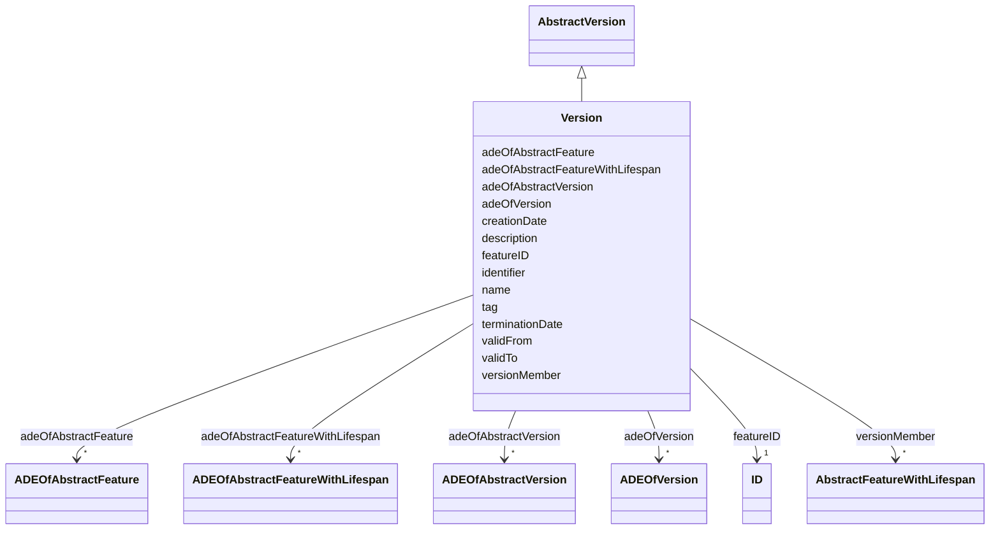

# Class: Version 


_Version represents a defined state of a city model consisting of the dedicated versions of all city object instances that belong to the respective city model version. Versions can have names, a description and can be labeled with an arbitrary number of user defined tags._


URI: [citygml:Version](https://www.ogc.org/standards/citygml/Version)





## Inheritance
* [AbstractFeature](AbstractFeature.md)
    * [AbstractFeatureWithLifespan](AbstractFeatureWithLifespan.md)
        * [AbstractVersion](AbstractVersion.md)
            * **Version**


## Slots

| Name | Cardinality and Range | Description | Inheritance |
| ---  | --- | --- | --- |
| [tag](tag.md) | * <br/> [String](String.md) | Allows for adding keywords to the city model version | direct |
| [adeOfVersion](adeOfVersion.md) | * <br/> [ADEOfVersion](ADEOfVersion.md) | Augments the Version with properties defined in an ADE | direct |
| [versionMember](versionMember.md) | * <br/> [AbstractFeatureWithLifespan](AbstractFeatureWithLifespan.md) | Relates to all city objects that are part of the city model version | direct |
| [adeOfAbstractVersion](adeOfAbstractVersion.md) | * <br/> [ADEOfAbstractVersion](ADEOfAbstractVersion.md) | Augments AbstractVersion with properties defined in an ADE | [AbstractVersion](AbstractVersion.md) |
| [creationDate](creationDate.md) | 0..1 <br/> [Datetime](Datetime.md) | Indicates the date at which a CityGML feature was added to the CityModel | [AbstractFeatureWithLifespan](AbstractFeatureWithLifespan.md) |
| [terminationDate](terminationDate.md) | 0..1 <br/> [Datetime](Datetime.md) | Indicates the date at which a CityGML feature was removed from the CityModel | [AbstractFeatureWithLifespan](AbstractFeatureWithLifespan.md) |
| [validFrom](validFrom.md) | 0..1 <br/> [Datetime](Datetime.md) | Indicates the date at which a CityGML feature started to exist in the real wo... | [AbstractFeatureWithLifespan](AbstractFeatureWithLifespan.md) |
| [validTo](validTo.md) | 0..1 <br/> [Datetime](Datetime.md) | Indicates the date at which a CityGML feature ended to exist in the real worl... | [AbstractFeatureWithLifespan](AbstractFeatureWithLifespan.md) |
| [adeOfAbstractFeatureWithLifespan](adeOfAbstractFeatureWithLifespan.md) | * <br/> [ADEOfAbstractFeatureWithLifespan](ADEOfAbstractFeatureWithLifespan.md) | Augments AbstractFeatureWithLifespan with properties defined in an ADE | [AbstractFeatureWithLifespan](AbstractFeatureWithLifespan.md) |
| [featureID](featureID.md) | 1 <br/> [ID](ID.md) |  | [AbstractFeature](AbstractFeature.md) |
| [identifier](identifier.md) | 0..1 <br/> [String](String.md) |  | [AbstractFeature](AbstractFeature.md) |
| [name](name.md) | * <br/> [String](String.md) |  | [AbstractFeature](AbstractFeature.md) |
| [description](description.md) | 0..1 <br/> [String](String.md) |  | [AbstractFeature](AbstractFeature.md) |
| [adeOfAbstractFeature](adeOfAbstractFeature.md) | * <br/> [ADEOfAbstractFeature](ADEOfAbstractFeature.md) | Augments AbstractFeature with properties defined in an ADE | [AbstractFeature](AbstractFeature.md) |


## Usages

| used by | used in | type | used |
| ---  | --- | --- | --- |
| [VersionTransition](VersionTransition.md) | [from](from.md) | range | [Version](Version.md) |
| [VersionTransition](VersionTransition.md) | [to](to.md) | range | [Version](Version.md) |


## Identifier and Mapping Information


### Schema Source


* from schema: https://www.ogc.org/standards/citygml


## Mappings

| Mapping Type | Mapped Value |
| ---  | ---  |
| self | citygml:Version |
| native | citygml:Version |


## LinkML Source

<!-- TODO: investigate https://stackoverflow.com/questions/37606292/how-to-create-tabbed-code-blocks-in-mkdocs-or-sphinx -->

### Direct

<details>
```yaml
name: Version
description: Version represents a defined state of a city model consisting of the
  dedicated versions of all city object instances that belong to the respective city
  model version. Versions can have names, a description and can be labeled with an
  arbitrary number of user defined tags.
from_schema: https://www.ogc.org/standards/citygml
is_a: AbstractVersion
abstract: false
attributes:
  tag:
    name: tag
    description: Allows for adding keywords to the city model version.
    from_schema: https://www.ogc.org/standards/citygml
    rank: 1000
    domain_of:
    - Version
    range: string
    required: false
    multivalued: true
  adeOfVersion:
    name: adeOfVersion
    description: Augments the Version with properties defined in an ADE.
    from_schema: https://www.ogc.org/standards/citygml
    rank: 1000
    domain_of:
    - Version
    range: ADEOfVersion
    required: false
    multivalued: true
  versionMember:
    name: versionMember
    description: Relates to all city objects that are part of the city model version.
    from_schema: https://www.ogc.org/standards/citygml
    domain_of:
    - CityModelMember
    - Version
    range: AbstractFeatureWithLifespan
    required: false
    multivalued: true

```
</details>

### Induced

<details>
```yaml
name: Version
description: Version represents a defined state of a city model consisting of the
  dedicated versions of all city object instances that belong to the respective city
  model version. Versions can have names, a description and can be labeled with an
  arbitrary number of user defined tags.
from_schema: https://www.ogc.org/standards/citygml
is_a: AbstractVersion
abstract: false
attributes:
  tag:
    name: tag
    description: Allows for adding keywords to the city model version.
    from_schema: https://www.ogc.org/standards/citygml
    rank: 1000
    alias: tag
    owner: Version
    domain_of:
    - Version
    range: string
    required: false
    multivalued: true
  adeOfVersion:
    name: adeOfVersion
    description: Augments the Version with properties defined in an ADE.
    from_schema: https://www.ogc.org/standards/citygml
    rank: 1000
    alias: adeOfVersion
    owner: Version
    domain_of:
    - Version
    range: ADEOfVersion
    required: false
    multivalued: true
  versionMember:
    name: versionMember
    description: Relates to all city objects that are part of the city model version.
    from_schema: https://www.ogc.org/standards/citygml
    alias: versionMember
    owner: Version
    domain_of:
    - CityModelMember
    - Version
    range: AbstractFeatureWithLifespan
    required: false
    multivalued: true
  adeOfAbstractVersion:
    name: adeOfAbstractVersion
    description: Augments AbstractVersion with properties defined in an ADE.
    from_schema: https://www.ogc.org/standards/citygml
    rank: 1000
    alias: adeOfAbstractVersion
    owner: Version
    domain_of:
    - AbstractVersion
    range: ADEOfAbstractVersion
    required: false
    multivalued: true
  creationDate:
    name: creationDate
    description: Indicates the date at which a CityGML feature was added to the CityModel.
    from_schema: https://www.ogc.org/standards/citygml
    rank: 1000
    alias: creationDate
    owner: Version
    domain_of:
    - AbstractFeatureWithLifespan
    range: datetime
    required: false
    multivalued: false
  terminationDate:
    name: terminationDate
    description: Indicates the date at which a CityGML feature was removed from the
      CityModel.
    from_schema: https://www.ogc.org/standards/citygml
    rank: 1000
    alias: terminationDate
    owner: Version
    domain_of:
    - AbstractFeatureWithLifespan
    range: datetime
    required: false
    multivalued: false
  validFrom:
    name: validFrom
    description: Indicates the date at which a CityGML feature started to exist in
      the real world.
    from_schema: https://www.ogc.org/standards/citygml
    rank: 1000
    alias: validFrom
    owner: Version
    domain_of:
    - AbstractFeatureWithLifespan
    range: datetime
    required: false
    multivalued: false
  validTo:
    name: validTo
    description: Indicates the date at which a CityGML feature ended to exist in the
      real world.
    from_schema: https://www.ogc.org/standards/citygml
    rank: 1000
    alias: validTo
    owner: Version
    domain_of:
    - AbstractFeatureWithLifespan
    range: datetime
    required: false
    multivalued: false
  adeOfAbstractFeatureWithLifespan:
    name: adeOfAbstractFeatureWithLifespan
    description: Augments AbstractFeatureWithLifespan with properties defined in an
      ADE.
    from_schema: https://www.ogc.org/standards/citygml
    rank: 1000
    alias: adeOfAbstractFeatureWithLifespan
    owner: Version
    domain_of:
    - AbstractFeatureWithLifespan
    range: ADEOfAbstractFeatureWithLifespan
    required: false
    multivalued: true
  featureID:
    name: featureID
    from_schema: https://www.ogc.org/standards/citygml
    rank: 1000
    alias: featureID
    owner: Version
    domain_of:
    - AbstractFeature
    range: ID
    required: true
    multivalued: false
  identifier:
    name: identifier
    from_schema: https://www.ogc.org/standards/citygml
    rank: 1000
    alias: identifier
    owner: Version
    domain_of:
    - AbstractFeature
    range: string
    required: false
    multivalued: false
  name:
    name: name
    from_schema: https://www.ogc.org/standards/citygml
    alias: name
    owner: Version
    domain_of:
    - CodeAttribute
    - DateAttribute
    - DoubleAttribute
    - GenericAttributeSet
    - IntAttribute
    - MeasureAttribute
    - StringAttribute
    - UriAttribute
    - AbstractFeature
    range: string
    required: false
    multivalued: true
  description:
    name: description
    from_schema: https://www.ogc.org/standards/citygml
    alias: description
    owner: Version
    domain_of:
    - ConstructionEvent
    - AbstractFeature
    range: string
    required: false
    multivalued: false
  adeOfAbstractFeature:
    name: adeOfAbstractFeature
    description: Augments AbstractFeature with properties defined in an ADE.
    from_schema: https://www.ogc.org/standards/citygml
    rank: 1000
    alias: adeOfAbstractFeature
    owner: Version
    domain_of:
    - AbstractFeature
    range: ADEOfAbstractFeature
    required: false
    multivalued: true

```
</details>