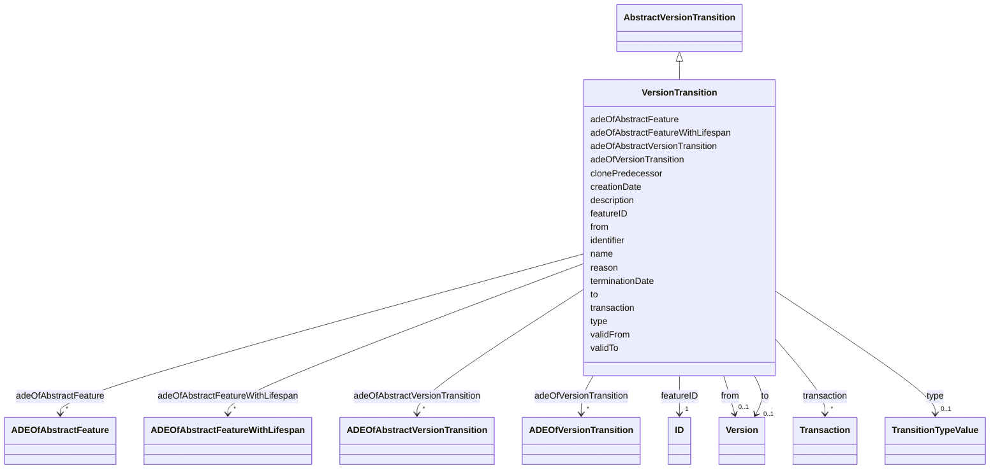

# Class: VersionTransition 


_VersionTransition describes the change of the state of a city model from one version to another. Version transitions can have names, a description and can be further qualified by a type and a reason._


URI: [citygml:VersionTransition](https://www.ogc.org/standards/citygml/VersionTransition)





## Inheritance
* [AbstractFeature](AbstractFeature.md)
    * [AbstractFeatureWithLifespan](AbstractFeatureWithLifespan.md)
        * [AbstractVersionTransition](AbstractVersionTransition.md)
            * **VersionTransition**


## Slots

| Name | Cardinality and Range | Description | Inheritance |
| ---  | --- | --- | --- |
| [reason](reason.md) | 0..1 <br/> [String](String.md) | Specifies why the VersionTransition has been carried out | direct |
| [clonePredecessor](clonePredecessor.md) | 1 <br/> [Boolean](Boolean.md) | Indicates whether the set of city object instances belonging to the successor... | direct |
| [type](type.md) | 0..1 <br/> [TransitionTypeValue](TransitionTypeValue.md) | Indicates the specific type of the VersionTransition | direct |
| [adeOfVersionTransition](adeOfVersionTransition.md) | * <br/> [ADEOfVersionTransition](ADEOfVersionTransition.md) | Augments the VersionTransition with properties defined in an ADE | direct |
| [from](from.md) | 0..1 <br/> [Version](Version.md) | Relates to the predecessor version of the VersionTransition | direct |
| [to](to.md) | 0..1 <br/> [Version](Version.md) | Relates to the successor version of the VersionTransition | direct |
| [transaction](transaction.md) | * <br/> [Transaction](Transaction.md) | Relates to all transactions that have been applied as part of the VersionTran... | direct |
| [adeOfAbstractVersionTransition](adeOfAbstractVersionTransition.md) | * <br/> [ADEOfAbstractVersionTransition](ADEOfAbstractVersionTransition.md) | Augments AbstractVersionTransition with properties defined in an ADE | [AbstractVersionTransition](AbstractVersionTransition.md) |
| [creationDate](creationDate.md) | 0..1 <br/> [Datetime](Datetime.md) | Indicates the date at which a CityGML feature was added to the CityModel | [AbstractFeatureWithLifespan](AbstractFeatureWithLifespan.md) |
| [terminationDate](terminationDate.md) | 0..1 <br/> [Datetime](Datetime.md) | Indicates the date at which a CityGML feature was removed from the CityModel | [AbstractFeatureWithLifespan](AbstractFeatureWithLifespan.md) |
| [validFrom](validFrom.md) | 0..1 <br/> [Datetime](Datetime.md) | Indicates the date at which a CityGML feature started to exist in the real wo... | [AbstractFeatureWithLifespan](AbstractFeatureWithLifespan.md) |
| [validTo](validTo.md) | 0..1 <br/> [Datetime](Datetime.md) | Indicates the date at which a CityGML feature ended to exist in the real worl... | [AbstractFeatureWithLifespan](AbstractFeatureWithLifespan.md) |
| [adeOfAbstractFeatureWithLifespan](adeOfAbstractFeatureWithLifespan.md) | * <br/> [ADEOfAbstractFeatureWithLifespan](ADEOfAbstractFeatureWithLifespan.md) | Augments AbstractFeatureWithLifespan with properties defined in an ADE | [AbstractFeatureWithLifespan](AbstractFeatureWithLifespan.md) |
| [featureID](featureID.md) | 1 <br/> [ID](ID.md) |  | [AbstractFeature](AbstractFeature.md) |
| [identifier](identifier.md) | 0..1 <br/> [String](String.md) |  | [AbstractFeature](AbstractFeature.md) |
| [name](name.md) | * <br/> [String](String.md) |  | [AbstractFeature](AbstractFeature.md) |
| [description](description.md) | 0..1 <br/> [String](String.md) |  | [AbstractFeature](AbstractFeature.md) |
| [adeOfAbstractFeature](adeOfAbstractFeature.md) | * <br/> [ADEOfAbstractFeature](ADEOfAbstractFeature.md) | Augments AbstractFeature with properties defined in an ADE | [AbstractFeature](AbstractFeature.md) |


## Identifier and Mapping Information


### Schema Source


* from schema: https://www.ogc.org/standards/citygml


## Mappings

| Mapping Type | Mapped Value |
| ---  | ---  |
| self | citygml:VersionTransition |
| native | citygml:VersionTransition |


## LinkML Source

<!-- TODO: investigate https://stackoverflow.com/questions/37606292/how-to-create-tabbed-code-blocks-in-mkdocs-or-sphinx -->

### Direct

<details>
```yaml
name: VersionTransition
description: VersionTransition describes the change of the state of a city model from
  one version to another. Version transitions can have names, a description and can
  be further qualified by a type and a reason.
from_schema: https://www.ogc.org/standards/citygml
is_a: AbstractVersionTransition
abstract: false
attributes:
  reason:
    name: reason
    description: Specifies why the VersionTransition has been carried out.
    from_schema: https://www.ogc.org/standards/citygml
    rank: 1000
    domain_of:
    - VersionTransition
    range: string
    required: false
    multivalued: false
  clonePredecessor:
    name: clonePredecessor
    description: Indicates whether the set of city object instances belonging to the
      successor version of the city model is either explicitly enumerated within the
      successor version object (attribute clonePredecessor=false),  or has to be derived
      from the modifications of the city model provided as a list of transactions
      on the city object versions contained in the predecessor version (attribute
      clonePredecessor=true).
    from_schema: https://www.ogc.org/standards/citygml
    rank: 1000
    domain_of:
    - VersionTransition
    range: boolean
    required: true
    multivalued: false
  type:
    name: type
    description: Indicates the specific type of the VersionTransition.
    from_schema: https://www.ogc.org/standards/citygml
    domain_of:
    - Transaction
    - VersionTransition
    range: TransitionTypeValue
    required: false
    multivalued: false
  adeOfVersionTransition:
    name: adeOfVersionTransition
    description: Augments the VersionTransition with properties defined in an ADE.
    from_schema: https://www.ogc.org/standards/citygml
    rank: 1000
    domain_of:
    - VersionTransition
    range: ADEOfVersionTransition
    required: false
    multivalued: true
  from:
    name: from
    description: Relates to the predecessor version of the VersionTransition.
    from_schema: https://www.ogc.org/standards/citygml
    rank: 1000
    domain_of:
    - VersionTransition
    range: Version
    required: false
    multivalued: false
  to:
    name: to
    description: Relates to the successor version of the VersionTransition.
    from_schema: https://www.ogc.org/standards/citygml
    rank: 1000
    domain_of:
    - VersionTransition
    range: Version
    required: false
    multivalued: false
  transaction:
    name: transaction
    description: Relates to all transactions that have been applied as part of the
      VersionTransition.
    from_schema: https://www.ogc.org/standards/citygml
    rank: 1000
    domain_of:
    - VersionTransition
    range: Transaction
    required: false
    multivalued: true

```
</details>

### Induced

<details>
```yaml
name: VersionTransition
description: VersionTransition describes the change of the state of a city model from
  one version to another. Version transitions can have names, a description and can
  be further qualified by a type and a reason.
from_schema: https://www.ogc.org/standards/citygml
is_a: AbstractVersionTransition
abstract: false
attributes:
  reason:
    name: reason
    description: Specifies why the VersionTransition has been carried out.
    from_schema: https://www.ogc.org/standards/citygml
    rank: 1000
    alias: reason
    owner: VersionTransition
    domain_of:
    - VersionTransition
    range: string
    required: false
    multivalued: false
  clonePredecessor:
    name: clonePredecessor
    description: Indicates whether the set of city object instances belonging to the
      successor version of the city model is either explicitly enumerated within the
      successor version object (attribute clonePredecessor=false),  or has to be derived
      from the modifications of the city model provided as a list of transactions
      on the city object versions contained in the predecessor version (attribute
      clonePredecessor=true).
    from_schema: https://www.ogc.org/standards/citygml
    rank: 1000
    alias: clonePredecessor
    owner: VersionTransition
    domain_of:
    - VersionTransition
    range: boolean
    required: true
    multivalued: false
  type:
    name: type
    description: Indicates the specific type of the VersionTransition.
    from_schema: https://www.ogc.org/standards/citygml
    alias: type
    owner: VersionTransition
    domain_of:
    - Transaction
    - VersionTransition
    range: TransitionTypeValue
    required: false
    multivalued: false
  adeOfVersionTransition:
    name: adeOfVersionTransition
    description: Augments the VersionTransition with properties defined in an ADE.
    from_schema: https://www.ogc.org/standards/citygml
    rank: 1000
    alias: adeOfVersionTransition
    owner: VersionTransition
    domain_of:
    - VersionTransition
    range: ADEOfVersionTransition
    required: false
    multivalued: true
  from:
    name: from
    description: Relates to the predecessor version of the VersionTransition.
    from_schema: https://www.ogc.org/standards/citygml
    rank: 1000
    alias: from
    owner: VersionTransition
    domain_of:
    - VersionTransition
    range: Version
    required: false
    multivalued: false
  to:
    name: to
    description: Relates to the successor version of the VersionTransition.
    from_schema: https://www.ogc.org/standards/citygml
    rank: 1000
    alias: to
    owner: VersionTransition
    domain_of:
    - VersionTransition
    range: Version
    required: false
    multivalued: false
  transaction:
    name: transaction
    description: Relates to all transactions that have been applied as part of the
      VersionTransition.
    from_schema: https://www.ogc.org/standards/citygml
    rank: 1000
    alias: transaction
    owner: VersionTransition
    domain_of:
    - VersionTransition
    range: Transaction
    required: false
    multivalued: true
  adeOfAbstractVersionTransition:
    name: adeOfAbstractVersionTransition
    description: Augments AbstractVersionTransition with properties defined in an
      ADE.
    from_schema: https://www.ogc.org/standards/citygml
    rank: 1000
    alias: adeOfAbstractVersionTransition
    owner: VersionTransition
    domain_of:
    - AbstractVersionTransition
    range: ADEOfAbstractVersionTransition
    required: false
    multivalued: true
  creationDate:
    name: creationDate
    description: Indicates the date at which a CityGML feature was added to the CityModel.
    from_schema: https://www.ogc.org/standards/citygml
    rank: 1000
    alias: creationDate
    owner: VersionTransition
    domain_of:
    - AbstractFeatureWithLifespan
    range: datetime
    required: false
    multivalued: false
  terminationDate:
    name: terminationDate
    description: Indicates the date at which a CityGML feature was removed from the
      CityModel.
    from_schema: https://www.ogc.org/standards/citygml
    rank: 1000
    alias: terminationDate
    owner: VersionTransition
    domain_of:
    - AbstractFeatureWithLifespan
    range: datetime
    required: false
    multivalued: false
  validFrom:
    name: validFrom
    description: Indicates the date at which a CityGML feature started to exist in
      the real world.
    from_schema: https://www.ogc.org/standards/citygml
    rank: 1000
    alias: validFrom
    owner: VersionTransition
    domain_of:
    - AbstractFeatureWithLifespan
    range: datetime
    required: false
    multivalued: false
  validTo:
    name: validTo
    description: Indicates the date at which a CityGML feature ended to exist in the
      real world.
    from_schema: https://www.ogc.org/standards/citygml
    rank: 1000
    alias: validTo
    owner: VersionTransition
    domain_of:
    - AbstractFeatureWithLifespan
    range: datetime
    required: false
    multivalued: false
  adeOfAbstractFeatureWithLifespan:
    name: adeOfAbstractFeatureWithLifespan
    description: Augments AbstractFeatureWithLifespan with properties defined in an
      ADE.
    from_schema: https://www.ogc.org/standards/citygml
    rank: 1000
    alias: adeOfAbstractFeatureWithLifespan
    owner: VersionTransition
    domain_of:
    - AbstractFeatureWithLifespan
    range: ADEOfAbstractFeatureWithLifespan
    required: false
    multivalued: true
  featureID:
    name: featureID
    from_schema: https://www.ogc.org/standards/citygml
    rank: 1000
    alias: featureID
    owner: VersionTransition
    domain_of:
    - AbstractFeature
    range: ID
    required: true
    multivalued: false
  identifier:
    name: identifier
    from_schema: https://www.ogc.org/standards/citygml
    rank: 1000
    alias: identifier
    owner: VersionTransition
    domain_of:
    - AbstractFeature
    range: string
    required: false
    multivalued: false
  name:
    name: name
    from_schema: https://www.ogc.org/standards/citygml
    alias: name
    owner: VersionTransition
    domain_of:
    - CodeAttribute
    - DateAttribute
    - DoubleAttribute
    - GenericAttributeSet
    - IntAttribute
    - MeasureAttribute
    - StringAttribute
    - UriAttribute
    - AbstractFeature
    range: string
    required: false
    multivalued: true
  description:
    name: description
    from_schema: https://www.ogc.org/standards/citygml
    alias: description
    owner: VersionTransition
    domain_of:
    - ConstructionEvent
    - AbstractFeature
    range: string
    required: false
    multivalued: false
  adeOfAbstractFeature:
    name: adeOfAbstractFeature
    description: Augments AbstractFeature with properties defined in an ADE.
    from_schema: https://www.ogc.org/standards/citygml
    rank: 1000
    alias: adeOfAbstractFeature
    owner: VersionTransition
    domain_of:
    - AbstractFeature
    range: ADEOfAbstractFeature
    required: false
    multivalued: true

```
</details>