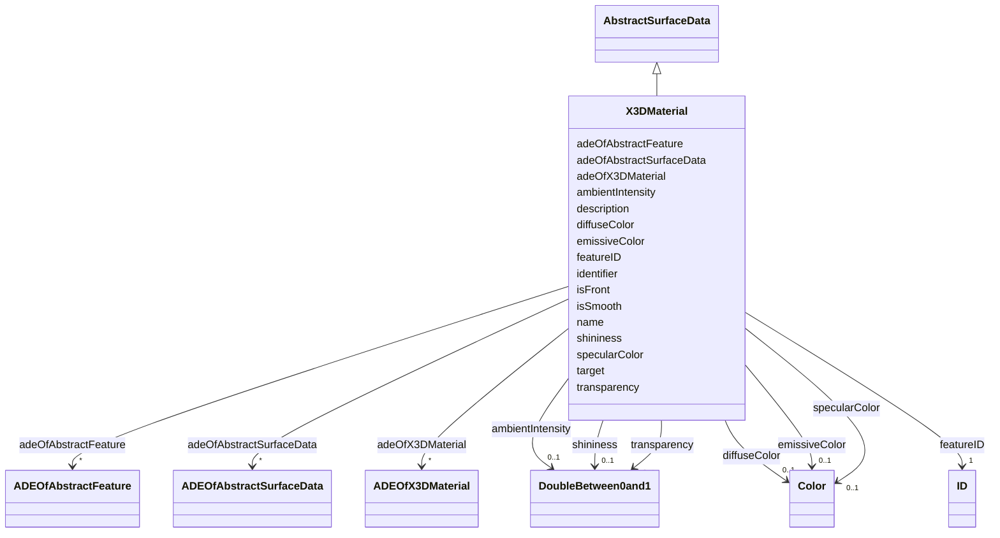

# Class: X3DMaterial 


_X3DMaterial defines properties for surface geometry objects based on the material definitions from the X3D and COLLADA standards._


URI: [citygml:X3DMaterial](https://www.ogc.org/standards/citygml/X3DMaterial)





## Inheritance
* [AbstractFeature](AbstractFeature.md)
    * [AbstractSurfaceData](AbstractSurfaceData.md)
        * **X3DMaterial**


## Slots

| Name | Cardinality and Range | Description | Inheritance |
| ---  | --- | --- | --- |
| [ambientIntensity](ambientIntensity.md) | 0..1 <br/> [DoubleBetween0and1](DoubleBetween0and1.md) | Specifies the minimum percentage of diffuseColor that is visible regardless o... | direct |
| [diffuseColor](diffuseColor.md) | 0..1 <br/> [Color](Color.md) | Specifies the color of the light diffusely reflected by the surface geometry ... | direct |
| [emissiveColor](emissiveColor.md) | 0..1 <br/> [Color](Color.md) | Specifies the color of the light emitted by the surface geometry object | direct |
| [specularColor](specularColor.md) | 0..1 <br/> [Color](Color.md) | Specifies the color of the light directly reflected by the surface geometry o... | direct |
| [shininess](shininess.md) | 0..1 <br/> [DoubleBetween0and1](DoubleBetween0and1.md) | Specifies the sharpness of the specular highlight | direct |
| [transparency](transparency.md) | 0..1 <br/> [DoubleBetween0and1](DoubleBetween0and1.md) | Specifies the degree of transparency of the surface geometry object | direct |
| [isSmooth](isSmooth.md) | 0..1 <br/> [Boolean](Boolean.md) | Specifies which interpolation method is used for the shading of the surface g... | direct |
| [target](target.md) | * <br/> [Uri](Uri.md) | Specifies the URI that points to the surface geometry objects to which the ma... | direct |
| [adeOfX3DMaterial](adeOfX3DMaterial.md) | * <br/> [ADEOfX3DMaterial](ADEOfX3DMaterial.md) | Augments the X3DMaterial with properties defined in an ADE | direct |
| [isFront](isFront.md) | 0..1 <br/> [Boolean](Boolean.md) | Indicates whether the texture or material is assigned to the front side or th... | [AbstractSurfaceData](AbstractSurfaceData.md) |
| [adeOfAbstractSurfaceData](adeOfAbstractSurfaceData.md) | * <br/> [ADEOfAbstractSurfaceData](ADEOfAbstractSurfaceData.md) | Augments AbstractSurfaceData with properties defined in an ADE | [AbstractSurfaceData](AbstractSurfaceData.md) |
| [featureID](featureID.md) | 1 <br/> [ID](ID.md) |  | [AbstractFeature](AbstractFeature.md) |
| [identifier](identifier.md) | 0..1 <br/> [String](String.md) |  | [AbstractFeature](AbstractFeature.md) |
| [name](name.md) | * <br/> [String](String.md) |  | [AbstractFeature](AbstractFeature.md) |
| [description](description.md) | 0..1 <br/> [String](String.md) |  | [AbstractFeature](AbstractFeature.md) |
| [adeOfAbstractFeature](adeOfAbstractFeature.md) | * <br/> [ADEOfAbstractFeature](ADEOfAbstractFeature.md) | Augments AbstractFeature with properties defined in an ADE | [AbstractFeature](AbstractFeature.md) |


## Identifier and Mapping Information


### Schema Source


* from schema: https://www.ogc.org/standards/citygml


## Mappings

| Mapping Type | Mapped Value |
| ---  | ---  |
| self | citygml:X3DMaterial |
| native | citygml:X3DMaterial |


## LinkML Source

<!-- TODO: investigate https://stackoverflow.com/questions/37606292/how-to-create-tabbed-code-blocks-in-mkdocs-or-sphinx -->

### Direct

<details>
```yaml
name: X3DMaterial
description: X3DMaterial defines properties for surface geometry objects based on
  the material definitions from the X3D and COLLADA standards.
from_schema: https://www.ogc.org/standards/citygml
is_a: AbstractSurfaceData
abstract: false
attributes:
  ambientIntensity:
    name: ambientIntensity
    description: Specifies the minimum percentage of diffuseColor that is visible
      regardless of light sources.
    from_schema: https://www.ogc.org/standards/citygml
    rank: 1000
    domain_of:
    - X3DMaterial
    range: DoubleBetween0and1
    required: false
    multivalued: false
  diffuseColor:
    name: diffuseColor
    description: Specifies the color of the light diffusely reflected by the surface
      geometry object.
    from_schema: https://www.ogc.org/standards/citygml
    rank: 1000
    domain_of:
    - X3DMaterial
    range: Color
    required: false
    multivalued: false
  emissiveColor:
    name: emissiveColor
    description: Specifies the color of the light emitted by the surface geometry
      object.
    from_schema: https://www.ogc.org/standards/citygml
    rank: 1000
    domain_of:
    - X3DMaterial
    range: Color
    required: false
    multivalued: false
  specularColor:
    name: specularColor
    description: Specifies the color of the light directly reflected by the surface
      geometry object.
    from_schema: https://www.ogc.org/standards/citygml
    rank: 1000
    domain_of:
    - X3DMaterial
    range: Color
    required: false
    multivalued: false
  shininess:
    name: shininess
    description: Specifies the sharpness of the specular highlight.
    from_schema: https://www.ogc.org/standards/citygml
    rank: 1000
    domain_of:
    - X3DMaterial
    range: DoubleBetween0and1
    required: false
    multivalued: false
  transparency:
    name: transparency
    description: Specifies the degree of transparency of the surface geometry object.
    from_schema: https://www.ogc.org/standards/citygml
    rank: 1000
    domain_of:
    - X3DMaterial
    range: DoubleBetween0and1
    required: false
    multivalued: false
  isSmooth:
    name: isSmooth
    description: Specifies which interpolation method is used for the shading of the
      surface geometry object. If the attribute is set to true, vertex normals should
      be used for shading (Gouraud shading). Otherwise, normals should be constant
      for a surface patch (flat shading).
    from_schema: https://www.ogc.org/standards/citygml
    rank: 1000
    domain_of:
    - X3DMaterial
    range: boolean
    required: false
    multivalued: false
  target:
    name: target
    description: Specifies the URI that points to the surface geometry objects to
      which the material is applied.
    from_schema: https://www.ogc.org/standards/citygml
    domain_of:
    - GeoreferencedTexture
    - X3DMaterial
    range: uri
    required: false
    multivalued: true
  adeOfX3DMaterial:
    name: adeOfX3DMaterial
    description: Augments the X3DMaterial with properties defined in an ADE.
    from_schema: https://www.ogc.org/standards/citygml
    rank: 1000
    domain_of:
    - X3DMaterial
    range: ADEOfX3DMaterial
    required: false
    multivalued: true

```
</details>

### Induced

<details>
```yaml
name: X3DMaterial
description: X3DMaterial defines properties for surface geometry objects based on
  the material definitions from the X3D and COLLADA standards.
from_schema: https://www.ogc.org/standards/citygml
is_a: AbstractSurfaceData
abstract: false
attributes:
  ambientIntensity:
    name: ambientIntensity
    description: Specifies the minimum percentage of diffuseColor that is visible
      regardless of light sources.
    from_schema: https://www.ogc.org/standards/citygml
    rank: 1000
    alias: ambientIntensity
    owner: X3DMaterial
    domain_of:
    - X3DMaterial
    range: DoubleBetween0and1
    required: false
    multivalued: false
  diffuseColor:
    name: diffuseColor
    description: Specifies the color of the light diffusely reflected by the surface
      geometry object.
    from_schema: https://www.ogc.org/standards/citygml
    rank: 1000
    alias: diffuseColor
    owner: X3DMaterial
    domain_of:
    - X3DMaterial
    range: Color
    required: false
    multivalued: false
  emissiveColor:
    name: emissiveColor
    description: Specifies the color of the light emitted by the surface geometry
      object.
    from_schema: https://www.ogc.org/standards/citygml
    rank: 1000
    alias: emissiveColor
    owner: X3DMaterial
    domain_of:
    - X3DMaterial
    range: Color
    required: false
    multivalued: false
  specularColor:
    name: specularColor
    description: Specifies the color of the light directly reflected by the surface
      geometry object.
    from_schema: https://www.ogc.org/standards/citygml
    rank: 1000
    alias: specularColor
    owner: X3DMaterial
    domain_of:
    - X3DMaterial
    range: Color
    required: false
    multivalued: false
  shininess:
    name: shininess
    description: Specifies the sharpness of the specular highlight.
    from_schema: https://www.ogc.org/standards/citygml
    rank: 1000
    alias: shininess
    owner: X3DMaterial
    domain_of:
    - X3DMaterial
    range: DoubleBetween0and1
    required: false
    multivalued: false
  transparency:
    name: transparency
    description: Specifies the degree of transparency of the surface geometry object.
    from_schema: https://www.ogc.org/standards/citygml
    rank: 1000
    alias: transparency
    owner: X3DMaterial
    domain_of:
    - X3DMaterial
    range: DoubleBetween0and1
    required: false
    multivalued: false
  isSmooth:
    name: isSmooth
    description: Specifies which interpolation method is used for the shading of the
      surface geometry object. If the attribute is set to true, vertex normals should
      be used for shading (Gouraud shading). Otherwise, normals should be constant
      for a surface patch (flat shading).
    from_schema: https://www.ogc.org/standards/citygml
    rank: 1000
    alias: isSmooth
    owner: X3DMaterial
    domain_of:
    - X3DMaterial
    range: boolean
    required: false
    multivalued: false
  target:
    name: target
    description: Specifies the URI that points to the surface geometry objects to
      which the material is applied.
    from_schema: https://www.ogc.org/standards/citygml
    alias: target
    owner: X3DMaterial
    domain_of:
    - GeoreferencedTexture
    - X3DMaterial
    range: uri
    required: false
    multivalued: true
  adeOfX3DMaterial:
    name: adeOfX3DMaterial
    description: Augments the X3DMaterial with properties defined in an ADE.
    from_schema: https://www.ogc.org/standards/citygml
    rank: 1000
    alias: adeOfX3DMaterial
    owner: X3DMaterial
    domain_of:
    - X3DMaterial
    range: ADEOfX3DMaterial
    required: false
    multivalued: true
  isFront:
    name: isFront
    description: Indicates whether the texture or material is assigned to the front
      side or the back side of the surface geometry object.
    from_schema: https://www.ogc.org/standards/citygml
    rank: 1000
    alias: isFront
    owner: X3DMaterial
    domain_of:
    - AbstractSurfaceData
    range: boolean
    required: false
    multivalued: false
  adeOfAbstractSurfaceData:
    name: adeOfAbstractSurfaceData
    description: Augments AbstractSurfaceData with properties defined in an ADE.
    from_schema: https://www.ogc.org/standards/citygml
    rank: 1000
    alias: adeOfAbstractSurfaceData
    owner: X3DMaterial
    domain_of:
    - AbstractSurfaceData
    range: ADEOfAbstractSurfaceData
    required: false
    multivalued: true
  featureID:
    name: featureID
    from_schema: https://www.ogc.org/standards/citygml
    rank: 1000
    alias: featureID
    owner: X3DMaterial
    domain_of:
    - AbstractFeature
    range: ID
    required: true
    multivalued: false
  identifier:
    name: identifier
    from_schema: https://www.ogc.org/standards/citygml
    rank: 1000
    alias: identifier
    owner: X3DMaterial
    domain_of:
    - AbstractFeature
    range: string
    required: false
    multivalued: false
  name:
    name: name
    from_schema: https://www.ogc.org/standards/citygml
    alias: name
    owner: X3DMaterial
    domain_of:
    - CodeAttribute
    - DateAttribute
    - DoubleAttribute
    - GenericAttributeSet
    - IntAttribute
    - MeasureAttribute
    - StringAttribute
    - UriAttribute
    - AbstractFeature
    range: string
    required: false
    multivalued: true
  description:
    name: description
    from_schema: https://www.ogc.org/standards/citygml
    alias: description
    owner: X3DMaterial
    domain_of:
    - ConstructionEvent
    - AbstractFeature
    range: string
    required: false
    multivalued: false
  adeOfAbstractFeature:
    name: adeOfAbstractFeature
    description: Augments AbstractFeature with properties defined in an ADE.
    from_schema: https://www.ogc.org/standards/citygml
    rank: 1000
    alias: adeOfAbstractFeature
    owner: X3DMaterial
    domain_of:
    - AbstractFeature
    range: ADEOfAbstractFeature
    required: false
    multivalued: true

```
</details>